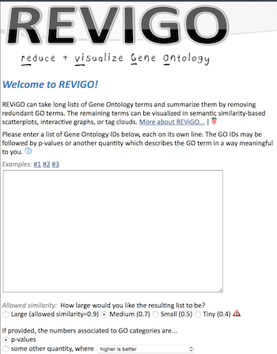

### gProfiler

[gProfileR](http://biit.cs.ut.ee/gprofiler/index.cgi) is a tool for the interpretation of large gene lists which can be run using a web interface or through R. The core tool takes a gene list as input and performs statistical enrichment analysis using hypergeometric testing similar to clusterProfiler. **Multiple sources of functional evidence are considered, including Gene Ontology terms, biological pathways, regulatory motifs of transcription factors and microRNAs, human disease annotations and protein-protein interactions.** The user selects the organism and the sources of evidence to test. There are also additional parameters to change various thresholds and tweak the stringency to the desired level. 

The GO terms output by gprofileR are generally quite similar to those output by clusterProfiler, but there are small differences due to the different algorithms used by the programs.


You can use gProfiler for a wide selection of organisms, and the tool accepts your gene list as input. If your gene list is ordered (e.g. by padj. values), then gProfiler will take the order of the genes into account when outputting enriched terms or pathways.

In addition, a **large number (70%) of the functional annotations of GO terms** are determined using _in silico_ methods to infer function from electronic annotation (IEA). While these annotations can offer valuable information, the information is of lower confidence than experimental and computational studies, and these functional annotations can be easily filtered out. 

The color codes in the gProfiler output represent the quality of the evidence for the functional annotation. For example, weaker evidence is depicted in blue, while strong evidence generated by direct experiment is shown with red or orange. Similar coloring is used for pathway information, with well-researched pathway information shown in black, opposed to lighter colors. Grey coloring suggests an unknown gene product or annotation. For more information, please see the [gProfiler paper](http://www.ncbi.nlm.nih.gov/pmc/articles/PMC1933153/).

Also, due to the hierarchical structure of GO terms, you may return many terms that seem redundant since they are child and parent terms. gProfiler allows for 'hierarchical filtering', returning only the best term per parent term.

We encourage you to explore gProfiler online, for today's class we will be demonstrating how to run it using the R package.

#### Running gProfiler

We can run gProfileR relatively easily from R, by loading the library and running the  `gprofiler` function.

```r

## Running gprofiler to identify enriched processes among significant genes

gprofiler_results_oe <- gprofiler(query = sigOE_genes, 
                                  organism = "hsapiens",
                                  ordered_query = F, 
                                  exclude_iea = F, 
                                  max_p_value = 0.05, 
                                  max_set_size = 0,
                                  correction_method = "fdr",
                                  hier_filtering = "none", 
                                  domain_size = "annotated",
                                  custom_bg = allOE_genes)

```

Let's save the gProfiler results to file:

```r
## Subset and reorder gProfiler results to only include columns of interest
gprofiler_results_oe_reordered <- gprofiler_results_oe[, c("term.id", "domain", "term.name", "p.value", "overlap.size", "term.size", "intersection")]

## Order the results by p-adjusted value
gprofiler_results_oe_reordered <- gprofiler_results_oe_reordered[order(gprofiler_results_oe_reordered$p.value), ]

## Extract only the 'GO' terms from the results
gprofiler_results_oe_GOs <- gprofiler_results_oe_reordered[grep('GO:', gprofiler_results_oe_reordered$term.id), ]

## Write the enriched GO results to file
write.csv(gprofiler_results_oe_GOs, 
            "results/gprofiler_MOV10_oe.csv")
```

Now, extract only those lines in the gProfiler results with GO term accession numbers and associated padj values for downstream analyses:

```r
## Extract only GO IDs and p-values for downstream analysis

GOpval_oe <- gprofiler_results_oe_GOs[ , c("term.id", "p.value")]

write.table(GOpval_oe, "results/GOs_oe.txt", quote=FALSE, row.names = FALSE, col.names = FALSE)

```

### REVIGO

[REVIGO](http://revigo.irb.hr/) is a web-based tool that can take our list of GO terms, collapse redundant terms by semantic similarity, and summarize them graphically. 



Open `GOs_oe.txt` and copy and paste the contents into the REVIGO search box, and submit.

After the program runs, there may not be output to the screen, but you can click on the `Treemap` tab. At the bottom of the `Treemap` tab should be a link to an R script to create the treemap; click to download the script.


In RStudio, pull-down the `File` menu and choose `Open File`, then navigate to the `REVIGO_treemap.r` script to open. In the `REVIGO_treemap.r` script tab, scroll down the script to the end and replace with the following:

```r
## by default, outputs to a PDF file
pdf( file="results/revigo_treemap.pdf", width=16, height=9 ) # rename to appropriate path and file name

## change the `tmPlot()` command to `treemap()`
treemap(
	stuff,
	index = c("representative","description"),
	vSize = "abslog10pvalue",
	type = "categorical",
	vColor = "representative",
	title = "REVIGO Gene Ontology treemap",
	inflate.labels = FALSE,      # set this to TRUE for space-filling group labels - good for posters
	lowerbound.cex.labels = 0,   # try to draw as many labels as possible (still, some small squares may not get a label)
	bg.labels = "#CCCCCCAA",     # define background color of group labels
												       # "#CCCCCC00" is fully transparent, "#CCCCCCAA" is semi-transparent grey, NA is opaque
	position.legend = "none"
)

dev.off()
```


***
**Exercise**

Using the REVIGO output webpage, create a treemap for enriched GO processes for the Molecular Function ontology.

***

Over-representation analyses are only a single type of functional analysis method that is available for teasing apart the biological processes important to your condition of interest. Other types of analyses can be equally important or informative, including functional class scoring and pathway topology methods. 
